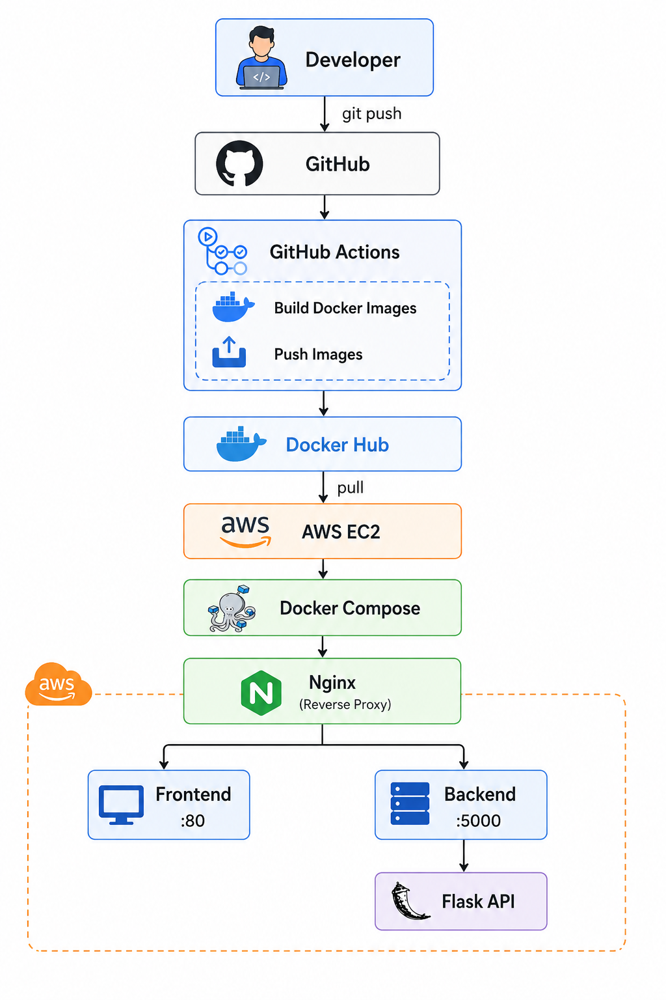
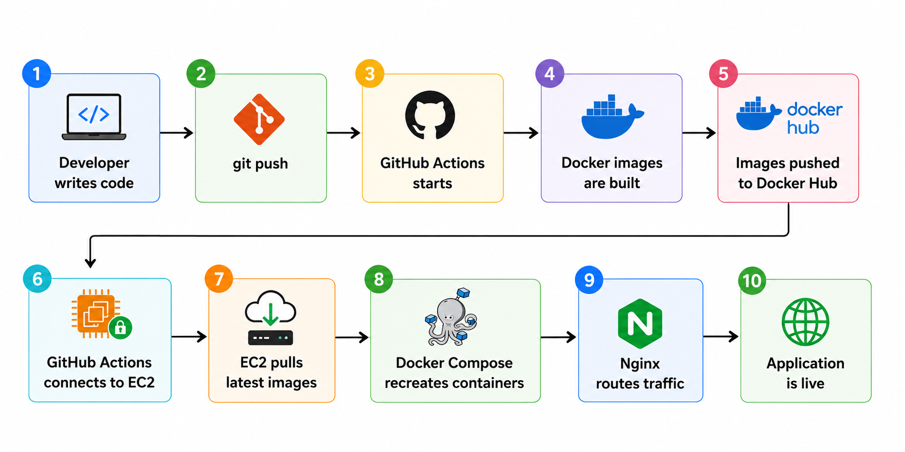

# 🚀 Task Manager — DevOps CI/CD Project

A containerized Task Manager application demonstrating an end-to-end DevOps workflow using **Git, GitHub, Docker, Docker Compose, Docker Hub, GitHub Actions, AWS EC2, Linux, and Nginx**.

The project focuses on containerization, Docker networking, reverse proxy configuration, image management, and automated deployment to AWS EC2.

## 🏗️ Architecture

## 🔄 Complete Deployment Flow

